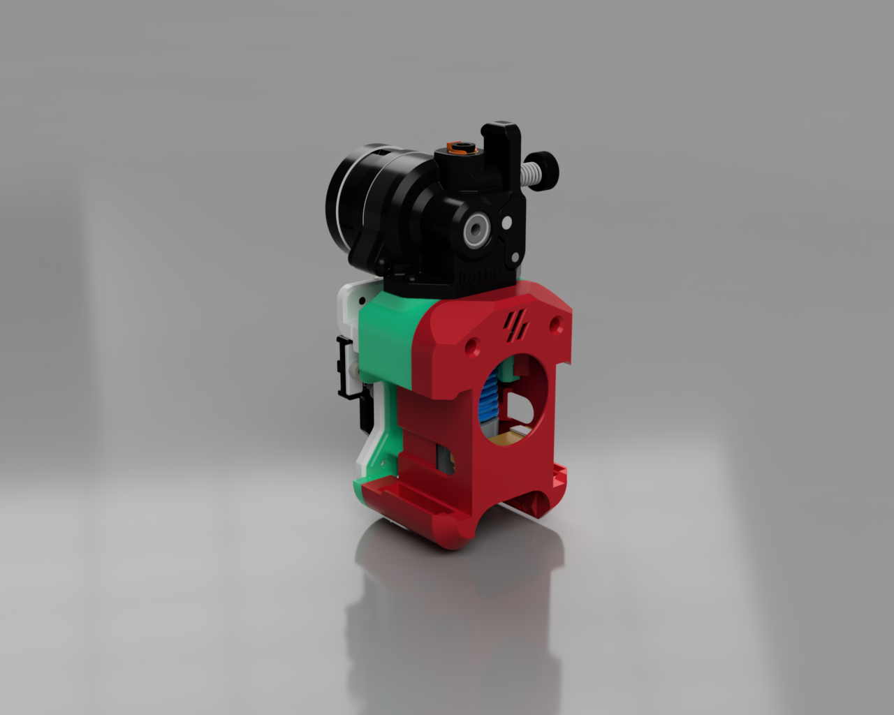

# Rapid Burner v8 - Simplified version
##Mission
This toolhead is a simplified version of the amazing [Rapid Burner Toolhead](https://github.com/chirpy2605/voron/edit/main/V0/Rapid_Burner) by [chirpy2605](https://github.com/chirpy2605).

While i love the design of the original version of this toolhead i wanted to achieve a **simpler design** for **improved maintainability** and a **simpler construction** for it to work specifically with the following hardware:
* [Rapido UHF V1](https://www.phaetus.com/products/rapido-hotend)
* [Chaoticlab TAP V1](https://chaoticlab.xyz/products/cnc-voron-tap)
* [Orbiter V2.0](https://www.orbiterprojects.com/orbiter-v2-0/)

The design reduced the overall parts from 4 to two main parts: A base plate and hotend/extruder assembly and the cover with all the fans. As a nice addon the airflow has been improved and also the weight has been slightly reduced. The LED mouts have not been changed. Designs can be downloaded from the original repository by chripy.

##BOM
* 2x M3x30 BHCS/SHCS to mount the main carriage to the TAP (top screws) - [Amazon Affiliate Link - Screw Set](https://amzn.to/48H36zz)
* 2x M3x4 BHCS/SHCS to mount the main carriage to the TAP (bottom screws) - [Amazon Affiliate Link - Screw Set](https://amzn.to/48H36zz)
* 2x M3x8 BHCS/SHCS to mount the the Orbiter 2.0 - [Amazon Affiliate Link - Screw Set](https://amzn.to/48H36zz)
* 4x M2x8 BHCS/SHCS to secure the front/cowl to the main carriage - [Amazon Affiliate Link - Screw Set](https://amzn.to/48H36zz)

* 4 x M2 brass heat inserts - [Amazon Affiliate Link](https://amzn.to/3S6VGAo)
* 2 x M3 brass heat inserts - [Amazon Affiliate Link](https://amzn.to/3tAfiU9)

* Rapido UHF V1 - [Amazon Affiliate Link](https://amzn.to/3S8BsGn)
* Chaoticlab TAP V1
* Orbiter V2.0 - [Amazon Affiliate Link](https://amzn.to/3vy1DNH)

* 2 x 4010 24v blower fans for part cooling
* 1 x 3010 24v axial fan for hotend cooling
* 3 x LEDs for logo and nozzle lights (optional, 2 for the hotend, 1 for the Logo, NeoPixels)
* 2 x 2.5mm nylon zip ties for cable management

* a bit of PTFE tube - [Amazon Affiliate Link](https://amzn.to/3TJWDzQ)
